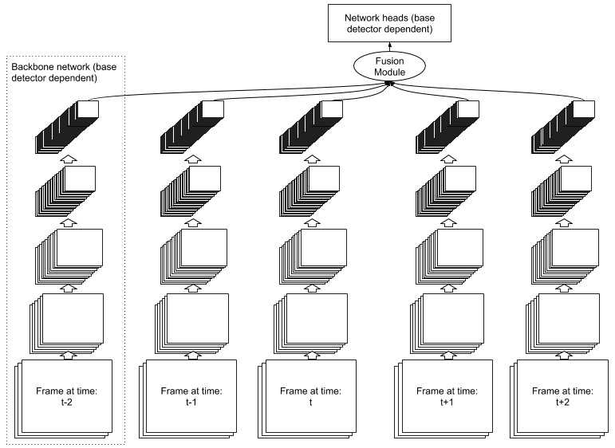

# FFAVOD
Repository for the paper FFAVOD: Feature Fusion Architecture for Video Object Detection
  by Hughes Perreault1, Guillaume-Alexandre Bilodeau1, Nicolas Saunier1 and Maguelonne Héritier2.
 
1 Polytechnique Montréal
2 Genetec  

## Code
Code will soon be added.

## Abstract
A significant amount of redundancy exists between consecutive frames of a video. Object detectors typically produce detections for one image at a time, without any capabilities for taking advantage of this redundancy. Meanwhile, many applications for object detection work with videos, including intelligent transportation systems, advanced driver assistance systems and video surveillance. Our work aims at taking advantage of the similarity between video frames to produce better detections. We propose FFAVOD, standing for feature fusion architecture for video object detection. We first introduce a novel video object detection architecture that allows a network to share feature maps between nearby frames. Second, we propose a feature fusion module that learns to merge feature maps to enhance them. We show that using the proposed architecture and the fusion module can improve the performance of three base object detectors on two object detection benchmarks containing sequences of moving road users. Using our architecture on the SpotNet base detector, we obtain the state-of-the-art performance on the UA-DETRAC public benchmark as well as on the UAVDT dataset.

## Model

A visual representation of FFAVOD with a window of 5 frames (n=2). Frames are passed through the backbone network of the base object detection network, and the fusion module takes their outputs as input. Finally, the fusion module outputs a fused feature map compatible with the base object detection network, and the base object detection heads are applied to the fused feature map to classify the object categories and regress the bounding boxes.

  

The fusion module. Channels are represented by colors. The fusion module  is  composed  of  channel  grouping,  concatenation  followed  by  1×1 convolution and a final re-ordering of channels.

## Results

For the official references, please refer to the paper. To the best of our knowledge, our method achieves SOTA on UA-DETRAC and UAVDT.

  

  

## Acknowledgements

The code for this paper is mainly built upon [CenterNet](https://github.com/xingyizhou/CenterNet), we would therefore like to thank the authors for providing the source code of their paper. We also acknowledge the support of the Natural Sciences and Engineering Research Council of Canada (NSERC), [RDCPJ 508883 - 17], and the support of Genetec.

## License

FFAVOD is released under the MIT License. Portions of the code are borrowed from [CenterNet](https://github.com/xingyizhou/CenterNet), [CornerNet](https://github.com/princeton-vl/CornerNet) (hourglassnet, loss functions), [dla](https://github.com/ucbdrive/dla) (DLA network), [DCNv2](https://github.com/CharlesShang/DCNv2)(deformable convolutions), and [cityscapesScripts](https://github.com/mcordts/cityscapesScripts) (cityscapes dataset evaluation). Please refer to the original License of these projects (See [NOTICE](NOTICE)).
